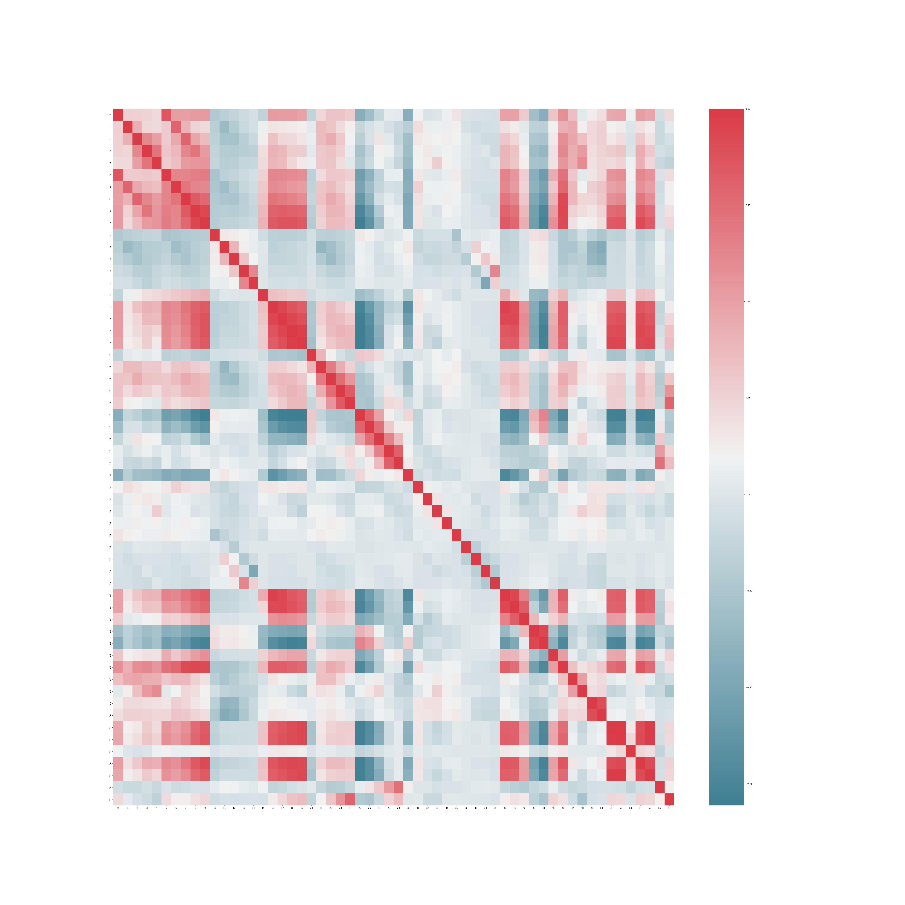

# weather-rectify
Code for weather rectify competition

## TODO: 
- [x] 训练三个网络
- [x] ordinal网络trainer构建
- [x] validate模块构建
- [x] 跑测试集！
- [x] 重新构建一个最简单的UNET
- [x] 到底什么是正确的提交格式啊啊啊啊啊啊啊啊啊！
- [x] 加分支分类器预测时间（已做好dataloader返回）
- [ ] 搞清楚那个把序回归转为具体降水值的公式！
- validate.py里有几个TODO是我想不明白的问题，有空看看TAT

 
## 学长的建议
- 先跑出一个简单baseline
- OD加上降水概率
- 加一个分支直接同时预测降水和气温
- 加入时间监督信息，即加一个额外分类器层预测是几点的降水/气温！！及其重要！
- 一个人调loss一个人调模型
- 试试图网络(不用试了)
- （试过图网络后）有余力的话可以试试可形变卷积

## BEST记录
confidence lr=1e-4  100k降
encoder lr=1e-2 500k降
ODR 无预训练 lr=1e-3 50k降

气温：0.59, /mnt/pami23/zhengxin/projects/weather/unet_temperature/output/Pred_temperature_0_59 
            (ckpt: /mnt/pami23/zhengxin/projects/weather/unet_temperature/checkpoint/unet_lr04_600)
    0.5966, /mnt/pami23/zhengxin/projects/temp/output/Pred_temperature_05966
            (ckpt: /mnt/pami23/zhengxin/projects/temp/checkpoint/unet_best_05966.pth)

## 验证记录
- ODA:
    confidence2.pth(没用), encoderwithodr2.pth, decoder.pth, odr2.pth | ts:0.07359,0.01593,0.00697,0
    confidence2.pth(没用), encoderwithodr3.pth, decoder.pth, odr3.pth | ts:0.16698,0.08479,0.00267,0
- unet:
    unet-5200.pth | ts: 0.52288, 0.30893, 0.13817, 0.04452 (1.19早第26名)
    unetwithtime200.pth | ts:0.55325 0.35189 0.15495 0.06053
    unetwithtime700.pth | ts:0.55613 0.37411 0.17546 0.07844(1.20中午27名)
    unetwithtimeinit200.pth(随机初始化) ｜ ts:0.54218 0.34381 0.14669 0.06306
    unetwithtimeinit700.pth(随机初始化) ｜ ts:0.55907 0.37914 0.18206 0.07829(1.20晚28名)
    unetwithtimeinitresample900.pth | ts:0.53944 0.37850 0.21543 0.11423
    unetwithtimeinitresample900.pth(threshold=0.1) | ts:0.59304 0.41909 0.25539 0.16229
## The correlation matrices between the features are as follows:

